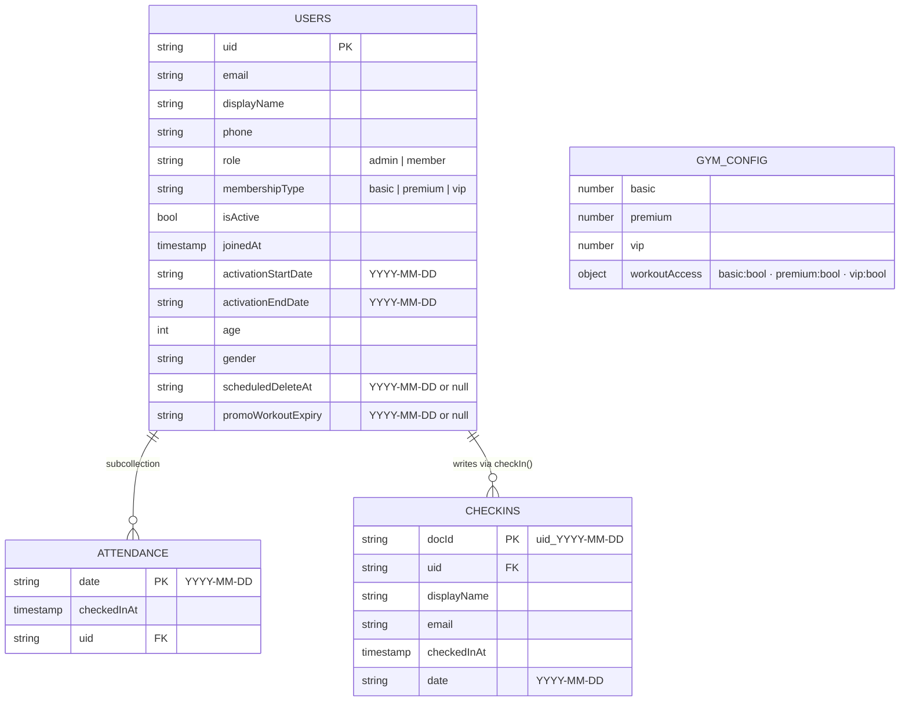
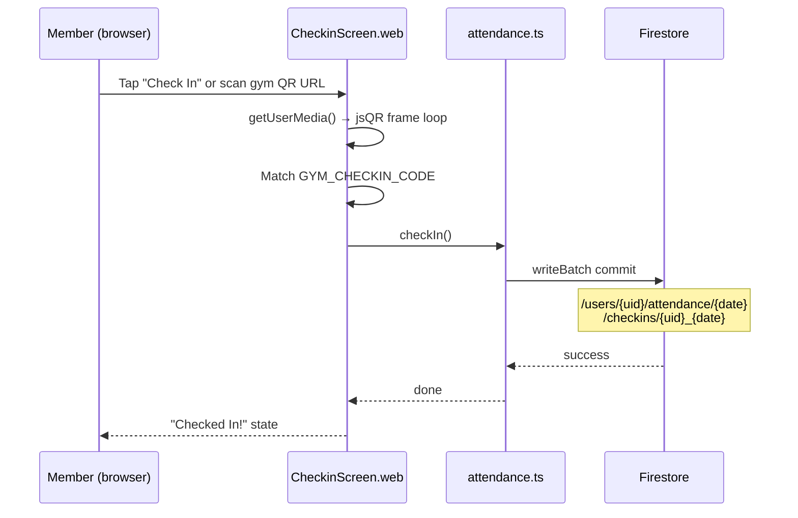
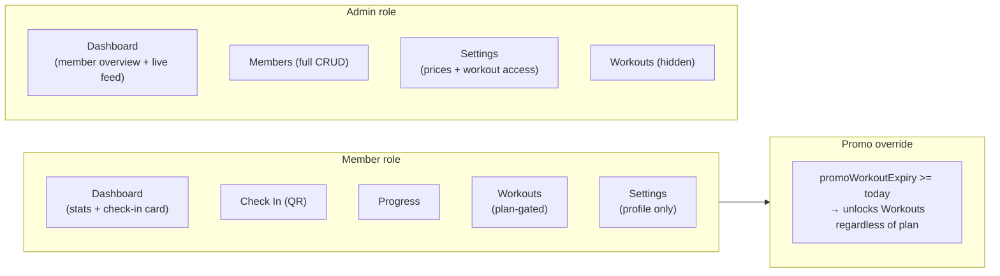

# StarGym — Architecture Diagram

## System Overview

```mermaid
graph TB
  subgraph CLIENT["Client — Expo Web App (dist/ served by Node server.js)"]
    direction TB

    subgraph NAV["Navigation"]
      AppRoot["App.tsx\nAuth gate · onAuthChange()"]
      Stack["NativeStack"]
      Drawer["DrawerNavigator"]
    end

    subgraph SCREENS_AUTH["Auth"]
      Login["LoginScreen"]
    end

    subgraph SCREENS_MEMBER["Member Screens"]
      Dashboard["DashboardScreen\nStats · QR card · Quick Actions"]
      Checkin["CheckinScreen.web\nLive QR scanner · jsQR"]
      Calendar["CalendarScreen\nAttendance calendar"]
      Progress["ProgressScreen\nMonthly goal · bar chart · week"]
      Workouts["WorkoutsScreen\n8 workout types · plan-gated"]
      Settings["SettingsScreen\nProfile (member) · Config (admin)"]
    end

    subgraph SCREENS_ADMIN["Admin Screens"]
      AdminList["AdminScreen\nMember list · search · history"]
      AdminDetail["AdminUserDetailScreen\nEdit · Disable · Promo access"]
    end

    subgraph SVC["Services (src/services/)"]
      AuthSvc["auth.ts\nsignIn · signUp · logOut · resetPassword"]
      UsersSvc["users.ts\nUserProfile CRUD · disable · enable"]
      AttendSvc["attendance.ts\ncheckIn · getMonthlyCount · subscribe"]
      GymSvc["gymSettings.ts\nprices · workoutAccess · subscribe"]
      EmailSvc["email.ts\nsendNewMemberNotification"]
      FirebaseSvc["firebase.ts\napp · auth · db"]
    end
  end

  subgraph FIREBASE["Firebase — stargym-bec65"]
    FBAuth["Firebase Auth\nEmail / Password"]
    subgraph FS["Firestore"]
      UsersDoc["/users/{uid}\nUserProfile document"]
      AttendCol["/users/{uid}/attendance/{YYYY-MM-DD}\nPer-user subcollection"]
      CheckinsCol["/checkins/{uid}_{YYYY-MM-DD}\nGlobal check-in log"]
      GymConfig["/gymConfig/membership\nPrices · WorkoutAccess"]
      ErrorLogs["/errorLogs/{id}\nRetry error log"]
    end
  end

  subgraph EXT["External Services"]
    EmailJS["EmailJS\nNew member email → admin"]
  end

  %% Auth flow
  AppRoot -->|onAuthChange| FBAuth
  Login --> AuthSvc --> FBAuth
  AuthSvc -->|createUserProfile on signup| UsersSvc

  %% Navigation tree
  AppRoot --> Stack
  Stack --> Drawer
  Stack --> Progress
  Stack --> AdminDetail
  Drawer --> Dashboard
  Drawer --> Checkin
  Drawer --> Calendar
  Drawer --> Workouts
  Drawer --> Settings
  Drawer --> AdminList

  %% Screen → Service wiring
  Dashboard --> AttendSvc
  Dashboard --> UsersSvc
  Dashboard --> GymSvc
  Checkin --> AttendSvc
  Calendar --> AttendSvc
  Progress --> AttendSvc
  Workouts --> GymSvc
  Workouts --> UsersSvc
  Settings --> UsersSvc
  Settings --> GymSvc
  AdminList --> UsersSvc
  AdminList --> AttendSvc
  AdminDetail --> UsersSvc

  %% Service → Firebase
  AuthSvc --> FBAuth
  UsersSvc --> UsersDoc
  AttendSvc -->|writeBatch atomic| AttendCol
  AttendSvc -->|writeBatch atomic| CheckinsCol
  GymSvc --> GymConfig
  FirebaseSvc --> FBAuth
  FirebaseSvc --> FS

  %% External
  EmailSvc --> EmailJS
  AuthSvc --> EmailSvc
```



---

## Firestore Schema



---

## Check-In Flow



---

## Role-Based Access



---

## Deployment

```
npm run build:web
  └── EXPO_OFFLINE=1 expo export → dist/

node server.js
  ├── HTTP  :3000  (redirect to HTTPS if cert present)
  └── HTTPS :3000  (self-signed cert via npm run gen-cert)
       └── serves dist/ as static files
```
